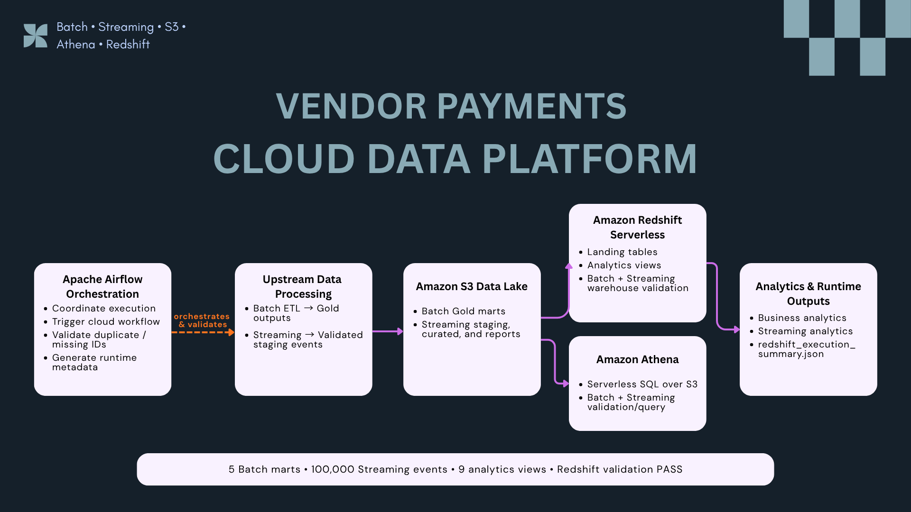
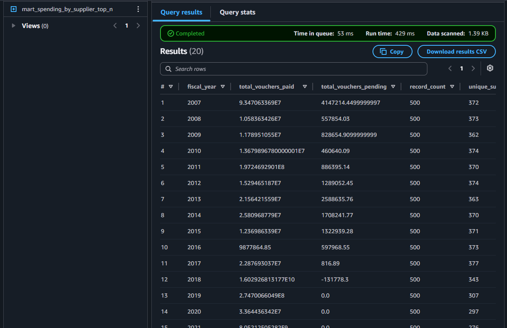
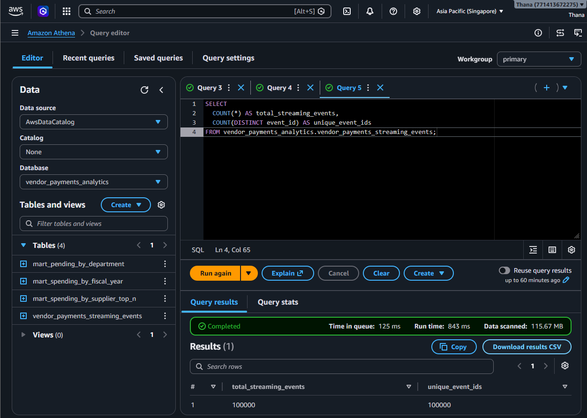
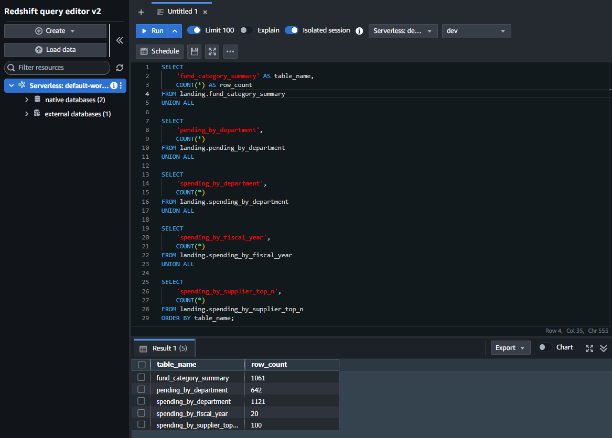
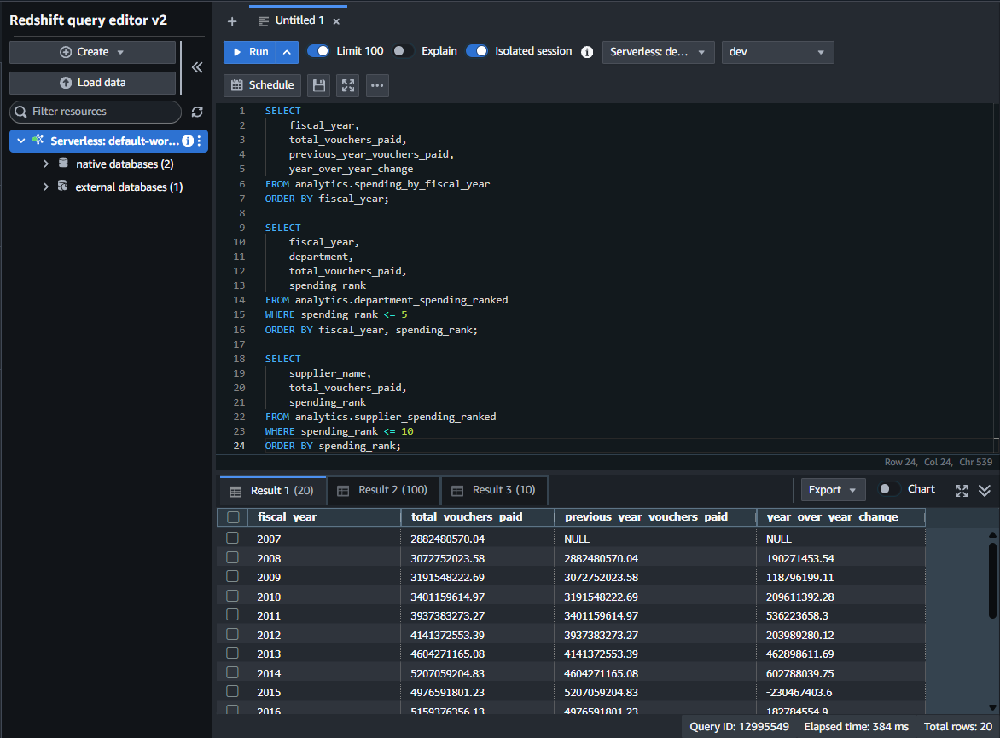
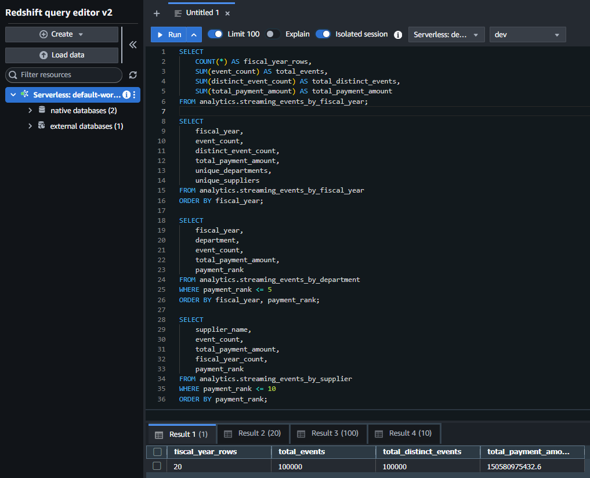
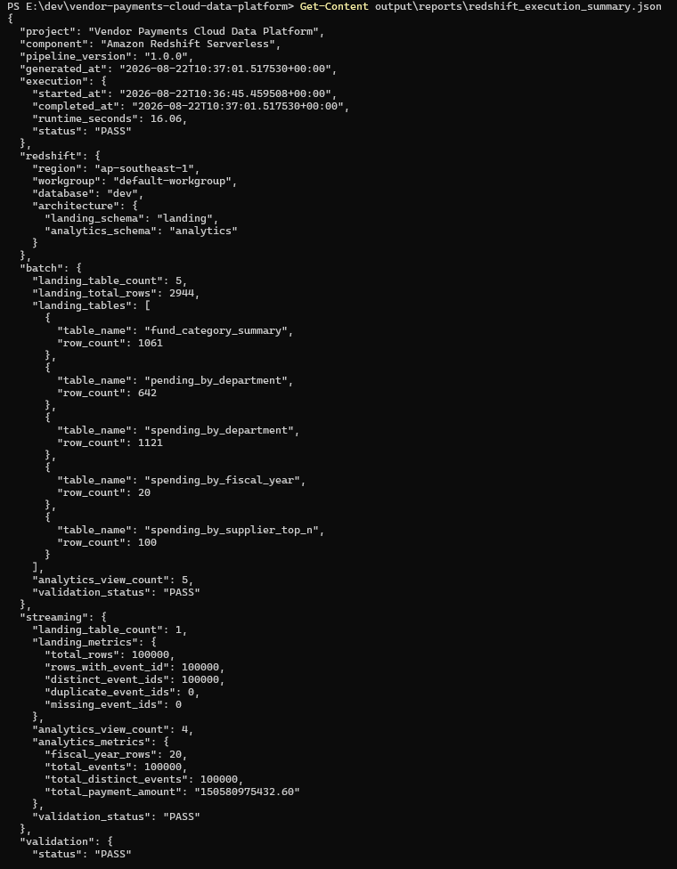
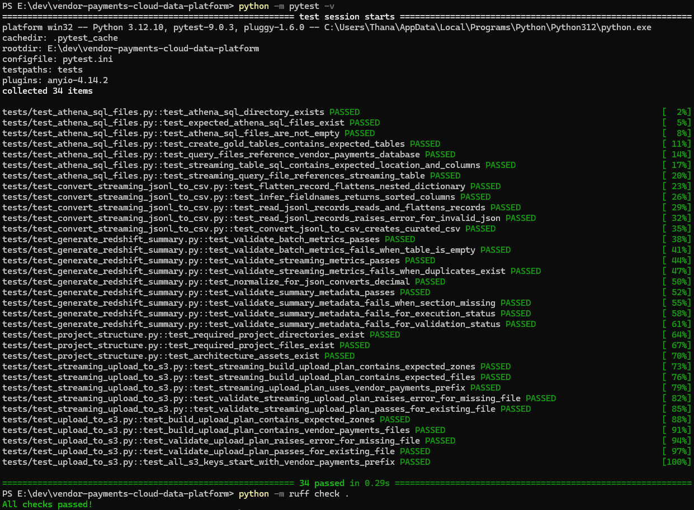
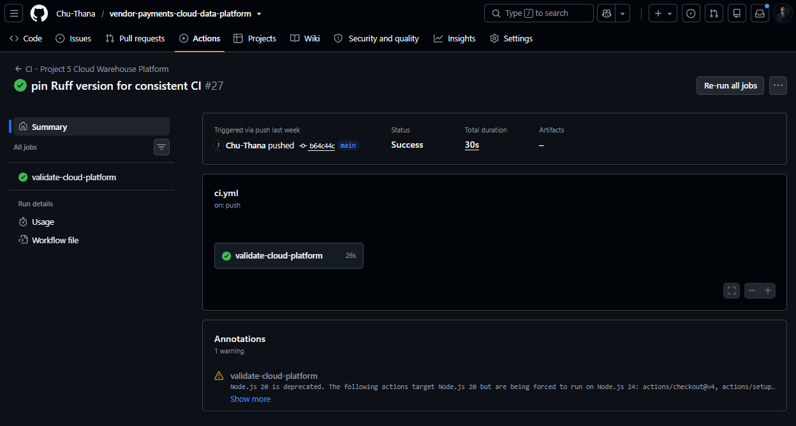

# ☁️ Vendor Payments Cloud Data Platform


AWS cloud and warehouse layer for the Vendor Payments Data Platform.

This repository publishes trusted Batch and Streaming outputs to Amazon S3, provides serverless SQL access through Amazon Athena, loads curated datasets into Amazon Redshift Serverless, creates analytics views, validates warehouse data quality, and generates machine-readable execution metadata.

---

## 📌 Project Summary

The project demonstrates how validated outputs from independent Batch and Streaming pipelines can be extended into a cloud analytics platform.

The Cloud Data Platform owns:

- Amazon S3 publishing and storage structure
- Streaming JSONL-to-CSV conversion logic used for cloud publishing
- Amazon Athena table definitions and analytics SQL
- Amazon Redshift schemas, landing tables, COPY operations, and analytics views
- Batch and Streaming warehouse validation
- Redshift runtime metadata generation
- Automated tests, Ruff linting, and GitHub Actions CI

The core responsibility boundary is:

```text
Batch and Streaming pipelines
→ produce validated upstream data

Cloud Data Platform
→ owns S3, Athena, Redshift, analytics SQL,
  warehouse validation, and runtime metadata

Airflow
→ invokes Cloud processing in execution order
  and validates the resulting outputs
```

Airflow orchestrates these Cloud capabilities, while the implementation remains in this repository.

---

## 🧭 Architecture



The platform supports two upstream processing paths:

- **Batch ETL Pipeline** — produces validated Silver and Gold analytics outputs
- **Kafka Streaming Pipeline** — produces validated and deduplicated JSONL staging events

The Cloud layer then provides durable storage and two analytics paths:

```text
                         ┌─→ Amazon Athena
Upstream Data → S3 ──────┤   Serverless SQL over S3
                         │
                         └─→ Amazon Redshift Serverless
                             Landing tables
                             → Analytics views
                             → Warehouse validation
```

### Responsibility Boundaries

- **Batch ETL** owns Raw → Silver → Gold transformation.
- **Kafka Streaming** owns event ingestion, Redis deduplication, and validated staging output.
- **Cloud Data Platform** owns cloud storage, Athena SQL, Redshift processing, analytics views, and warehouse metadata.
- **Airflow Orchestration** owns execution order, dependency coordination, downstream validation, and orchestration reporting.
- **API Serving** exposes trusted Batch and Streaming analytics to downstream applications.

---

## 📊 Validated Results

| Metric | Result |
| --- | ---: |
| Batch Gold marts published | 5 |
| Redshift Batch landing tables | 5 |
| Redshift Batch landing rows | 2,944 |
| Redshift Batch analytics views | 5 |
| Redshift Streaming landing tables | 1 |
| Streaming events loaded | 100,000 |
| Distinct streaming event IDs | 100,000 |
| Duplicate event IDs | 0 |
| Missing event IDs | 0 |
| Redshift Streaming analytics views | 4 |
| Total Redshift analytics views | 9 |
| Streaming fiscal-year rows | 20 |
| Latest metadata runtime | 16.06 seconds |
| Automated tests | 34 passed |
| Ruff linting | PASS |
| Runtime metadata validation | PASS |
| GitHub Actions CI | PASS |

These metrics are supported by S3, Athena, Redshift, runtime metadata, local validation, and CI evidence included in this repository.

---

## 🔄 Cloud Data Flow

```text
Batch ETL Gold outputs
→ Amazon S3
├──→ Amazon Athena external tables
└──→ Amazon Redshift Batch landing tables
     → Batch analytics views
     → Batch validation

Kafka Streaming staging JSONL
→ Cloud JSONL-to-CSV conversion
→ Amazon S3 Streaming curated data
├──→ Amazon Athena Streaming table
└──→ Amazon Redshift Streaming landing table
     → Streaming analytics views
     → Event-ID and aggregate validation

Redshift validation results
→ Runtime metadata generator
→ redshift_execution_summary.json
```

In the integrated platform, Airflow invokes the bounded Cloud steps and coordinates their execution with the upstream pipelines.

---

## 🪣 Amazon S3 Data Lake

Amazon S3 provides durable cloud storage for trusted Batch and Streaming outputs.

### Batch Storage

```text
data-platform/vendor-payments/
│
├── raw/
├── silver/
├── gold/
│   └── full/
│       ├── mart_fund_category_summary/
│       ├── mart_pending_by_department/
│       ├── mart_spending_by_department/
│       ├── mart_spending_by_fiscal_year/
│       └── mart_spending_by_supplier_top_n/
│
└── reports/
```

The five analytics-ready Gold marts are published into separate S3 prefixes.


### Streaming Storage

```text
data-platform/vendor-payments/streaming/
│
├── staging/
│   └── vendor_payments_streaming_staging.jsonl
│
├── curated/
│   └── vendor_payments_streaming_events.csv
│
└── reports/
```

The Cloud conversion script transforms validated JSONL staging events into a flattened curated CSV that can be queried by Athena and loaded into Redshift.

Generated data files remain outside Git and are published directly to Amazon S3.

---

## 🔎 Amazon Athena

Amazon Athena provides serverless SQL access directly over the S3 data lake.

SQL definitions are stored under:

```text
sql/athena/
```

The repository includes SQL for:

- Creating the analytics database
- Creating Batch Gold external tables
- Creating the Streaming external table
- Querying spending by fiscal year
- Querying top suppliers
- Querying pending payments by department
- Querying and validating Streaming events

### Batch Query Evidence

Athena queries the Batch Gold data directly from S3 and returns fiscal-year analytics without loading the data into Redshift first.



### Streaming Validation Evidence

Athena validates both total Streaming events and distinct event IDs:

```text
total_streaming_events = 100000
unique_event_ids       = 100000
```



Athena provides an independent serverless query path over the same curated S3 datasets used by the warehouse layer.

---

## 🏢 Amazon Redshift Serverless

Amazon Redshift Serverless provides the warehouse analytics layer.

The warehouse separates stored datasets from analytics logic through two schemas:

```text
landing
analytics
```

### Landing Schema

The `landing` schema stores trusted Batch and Streaming datasets copied from S3.

```text
landing.fund_category_summary
landing.pending_by_department
landing.spending_by_department
landing.spending_by_fiscal_year
landing.spending_by_supplier_top_n
landing.vendor_payments_streaming_events
```

### Analytics Schema

The `analytics` schema exposes reusable views for downstream analysis.

```text
Batch analytics views     = 5
Streaming analytics views = 4
Total analytics views     = 9
```

Redshift SQL is stored under:

```text
sql/redshift/
```

---

## 📦 Batch Warehouse Layer

The Batch warehouse flow loads five Gold marts from S3 into Redshift.

```text
S3 Gold marts
→ Redshift COPY
→ landing tables
→ analytics views
→ validation
```

### Batch Landing Validation

Validated row counts:

| Landing Table | Rows |
| --- | ---: |
| `fund_category_summary` | 1,061 |
| `pending_by_department` | 642 |
| `spending_by_department` | 1,121 |
| `spending_by_fiscal_year` | 20 |
| `spending_by_supplier_top_n` | 100 |
| **Total** | **2,944** |



### Batch Analytics

The Batch analytics layer provides fiscal-year, department, supplier, fund-category, and pending-payment analysis.

The fiscal-year view also calculates previous-year values and year-over-year changes directly in the warehouse.



---

## 🌊 Streaming Warehouse Layer

The Streaming warehouse flow loads the curated event dataset from S3 into Redshift.

```text
Validated JSONL staging events
→ Curated CSV
→ Amazon S3
→ Redshift landing table
→ Streaming analytics views
→ Validation
```

Validated warehouse metrics:

```text
total_rows             = 100000
distinct_event_ids     = 100000
duplicate_event_ids    = 0
missing_event_ids      = 0
analytics_view_count   = 4
fiscal_year_rows       = 20
total_events           = 100000
total_distinct_events  = 100000
```



These checks verify that the warehouse retains all accepted Streaming events, preserves unique event IDs, and produces analytics totals consistent with the landing dataset.

---

## 🧾 Runtime Metadata

The Redshift metadata generator queries the warehouse through the Redshift Data API.

Generator:

```text
scripts/warehouse/generate_redshift_summary.py
```

Generated artifact:

```text
output/reports/redshift_execution_summary.json
```

The execution artifact records:

```text
Project identity
Platform component
Pipeline version
Generation timestamp
Execution start and completion timestamps
Runtime
Execution status
AWS region
Redshift workgroup and database
Landing and analytics schemas
Batch warehouse metrics
Streaming warehouse metrics
Event-ID validation metrics
Overall validation status
Artifact path and format
```

Latest validated metadata includes:

```text
runtime_seconds                 = 16.06
execution.status                = PASS

batch.landing_table_count       = 5
batch.landing_total_rows        = 2944
batch.analytics_view_count      = 5

streaming.landing_table_count   = 1
streaming.total_rows            = 100000
streaming.distinct_event_ids    = 100000
streaming.duplicate_event_ids   = 0
streaming.missing_event_ids     = 0
streaming.analytics_view_count  = 4

validation.status               = PASS
```

The generator validates the required metadata contract before writing the JSON artifact.



---

## ✅ Automated Validation

Run the full local validation:

```powershell
python -m pytest -q
python -m ruff check .
```

Current result:

```text
34 passed in 0.20s
All checks passed!
```



### Test Coverage

The automated tests validate:

- Required project directories and files
- Final architecture and execution-evidence assets
- Batch S3 upload plans
- Streaming S3 upload plans
- Local input validation before upload
- S3 key and zone structure
- Streaming JSONL parsing
- Nested event-record flattening
- JSONL-to-CSV conversion
- Athena SQL file availability
- Batch Athena definitions
- Streaming Athena definitions
- Batch warehouse metric validation
- Streaming event-ID validation
- Required runtime metadata sections
- Missing metadata handling
- Invalid execution status handling
- Invalid validation status handling
- JSON-compatible value normalization

Unit tests do not require active AWS credentials or a live Redshift connection.

---

## ⚙️ Continuous Integration

GitHub Actions runs validation on pushes and pull requests to `main`.

```text
Ruff
→ Pytest
```

Workflow:

```text
.github/workflows/ci.yml
```

The CI workflow validates Python code, SQL assets, metadata contracts, project structure, and automated tests without performing Cloud write operations.



---

## 📸 Final Execution Evidence

The final evidence set is intentionally compact and covers each major responsibility:

```text
00_cloud_data_platform_architecture.png
01_s3_full_gold_marts.png
02_athena_batch_query.png
03_athena_streaming_validation.png
04_redshift_batch_landing.png
05_redshift_batch_analytics.png
06_redshift_streaming_validation.png
07_redshift_runtime_metadata.png
08_cloud_tests_and_lint.png
09_cloud_ci_success.png
```

Together, these screenshots demonstrate architecture, cloud storage, serverless querying, warehouse loading and analytics, data-quality validation, runtime metadata, automated testing, linting, and CI.

---

## 🗂️ Project Structure

```text
vendor-payments-cloud-data-platform/
│
├── .github/
│   └── workflows/
│       └── ci.yml
│
├── assets/
│   └── redshift/
│       ├── 00_cloud_data_platform_architecture.png
│       ├── 01_s3_full_gold_marts.png
│       ├── 02_athena_batch_query.png
│       ├── 03_athena_streaming_validation.png
│       ├── 04_redshift_batch_landing.png
│       ├── 05_redshift_batch_analytics.png
│       ├── 06_redshift_streaming_validation.png
│       ├── 07_redshift_runtime_metadata.png
│       ├── 08_cloud_tests_and_lint.png
│       └── 09_cloud_ci_success.png
│
├── scripts/
│   ├── batch/
│   │   ├── convert_to_parquet.py
│   │   ├── upload_csv_to_s3.py
│   │   ├── upload_full_gold_to_s3.py
│   │   └── upload_to_s3.py
│   │
│   ├── streaming/
│   │   ├── convert_streaming_jsonl_to_csv.py
│   │   └── upload_streaming_to_s3.py
│   │
│   └── warehouse/
│       └── generate_redshift_summary.py
│
├── sql/
│   ├── athena/
│   │   ├── 01_create_database.sql
│   │   ├── 02_create_gold_tables.sql
│   │   ├── 03_query_spending_by_fiscal_year.sql
│   │   ├── 04_query_top_suppliers.sql
│   │   ├── 05_query_pending_by_department.sql
│   │   ├── 06_create_streaming_events_table.sql
│   │   └── 07_query_streaming_events.sql
│   │
│   └── redshift/
│       ├── 01_create_schemas.sql
│       ├── 02_create_batch_landing_tables.sql
│       ├── 03_copy_batch_gold_from_s3.sql
│       ├── 04_create_batch_analytics_views.sql
│       ├── 05_validate_batch_analytics.sql
│       ├── 06_create_streaming_landing_table.sql
│       ├── 07_copy_streaming_curated_from_s3.sql
│       ├── 08_create_streaming_analytics_views.sql
│       └── 09_validate_streaming_analytics.sql
│
├── output/
│   └── reports/
│       └── redshift_execution_summary.json
│
├── tests/
│   ├── test_athena_sql_files.py
│   ├── test_convert_streaming_jsonl_to_csv.py
│   ├── test_generate_redshift_summary.py
│   ├── test_project_structure.py
│   ├── test_streaming_upload_to_s3.py
│   └── test_upload_to_s3.py
│
├── .env.example
├── .gitignore
├── pytest.ini
├── requirements.txt
└── README.md
```

---

## ▶️ Run Locally

Create and activate a virtual environment:

```powershell
python -m venv .venv
.venv\Scripts\Activate.ps1
```

Install dependencies:

```powershell
pip install -r requirements.txt
```

Run tests and Ruff:

```powershell
python -m pytest -q
python -m ruff check .
```

### Upload Batch Outputs

```powershell
python -m scripts.batch.upload_to_s3
```

### Convert Streaming JSONL to CSV

```powershell
python -m scripts.streaming.convert_streaming_jsonl_to_csv
```

### Upload Streaming Outputs

```powershell
python -m scripts.streaming.upload_streaming_to_s3
```

### Generate Redshift Runtime Metadata

```powershell
python scripts\warehouse\generate_redshift_summary.py
```

Cloud write operations and Redshift metadata generation require access to the configured AWS account.

In the integrated Vendor Payments platform, these Cloud capabilities are normally invoked by Airflow rather than run manually one by one.

---

## 🔧 Environment Configuration

AWS credentials are resolved through the standard AWS credential chain.

Example `.env.example` configuration:

```env
AWS_PROFILE=default
AWS_REGION=ap-southeast-1

S3_BUCKET=vendor-payments-data-platform-thana
S3_PREFIX=data-platform/vendor-payments

VENDOR_PAYMENTS_ETL_ROOT=E:\dev\vendor-payments-etl-analytics
VENDOR_PAYMENTS_STREAMING_ROOT=E:\dev\vendor-payments-streaming-pipeline
AIRFLOW_OUTPUT_ROOT=E:\dev\vendor-payments-airflow-orchestration\output

REDSHIFT_WORKGROUP=default-workgroup
REDSHIFT_DATABASE=dev
```

A local `.env` file is not required by the current repository workflow. Environment values can be supplied by the execution environment, and the scripts also provide local development defaults where applicable.

Do not commit real credentials, access keys, secrets, or sensitive account configuration.

---

## ☁️ Airflow Integration

The Cloud repository remains independently testable, but the integrated platform uses Apache Airflow to coordinate Cloud execution.

The main orchestration flow invokes Cloud-owned scripts and SQL in bounded tasks:

```text
Batch Gold validation
→ Upload Batch Gold to S3

Streaming staging validation
→ Downstream deduplication check
→ Convert Streaming JSONL to CSV
→ Upload Streaming curated output to S3

Cloud readiness
→ Create Redshift schemas
→ Batch Redshift processing
→ Streaming Redshift processing
→ Generate Redshift execution metadata
→ Validate Redshift execution metadata
```

This separation keeps implementation ownership clear:

```text
Cloud repository = implementation
Airflow repository = orchestration
```

---

## 💰 AWS Cost and Resource Management

The project uses serverless and object-storage services, but active AWS resources may still create charges.

Cost-sensitive resources include:

- Amazon S3 storage
- Athena data scanned
- Redshift Serverless compute
- Redshift managed storage
- AWS Glue Data Catalog usage beyond applicable quotas
- Data transfer where applicable

Recommended controls include reviewing Redshift Serverless usage, limiting unnecessary Athena scans, keeping only required S3 datasets, configuring AWS billing alerts, and removing unused validation resources.

The repository does not provision AWS infrastructure automatically.

---

## 🔗 Role in the Vendor Payments Data Platform

```text
Batch ETL Pipeline
→ validated Silver and Gold analytics outputs

Kafka Streaming Pipeline
→ validated and deduplicated staging events

Airflow Orchestration
→ execution order, dependency coordination,
  Cloud invocation, and cross-platform validation

Cloud Data Platform
→ Amazon S3
→ Amazon Athena
→ Amazon Redshift Serverless
→ analytics views
→ warehouse validation
→ runtime metadata

FastAPI Serving
→ trusted Batch and Streaming API endpoints

Power BI + React Analytics
→ business and event analytics consumption
```

This repository is the Cloud storage, serverless query, and warehouse-processing layer of the wider Vendor Payments platform.

It does not own Batch transformation logic, Kafka ingestion logic, Airflow DAG implementation, API routing, or dashboard presentation.

---

## 🧠 Key Engineering Decisions

- Keep Cloud implementation separate from orchestration.
- Use Amazon S3 as durable storage for trusted Batch and Streaming outputs.
- Separate Batch and Streaming storage zones.
- Use Athena for direct serverless SQL analysis over S3.
- Use Redshift Serverless for warehouse-oriented analytics.
- Separate landing tables from analytics views.
- Load trusted datasets from S3 instead of committing generated data to Git.
- Validate Streaming event-ID completeness and uniqueness at the warehouse layer.
- Validate relationships between landing data and analytics aggregates.
- Generate machine-readable runtime metadata rather than relying only on terminal logs.
- Enforce a metadata contract before writing the execution artifact.
- Use IAM and the Redshift Data API instead of storing database passwords.
- Validate code, SQL assets, project structure, and metadata logic through automated tests and CI.

---

## 🛣️ Planned Development

The current portfolio version is intentionally bounded and reproducible. Possible production-oriented extensions include:

- Infrastructure as Code for repeatable AWS deployment
- Partition-aware S3 and Athena optimization
- Incremental and window-based Streaming cloud publishing
- Historical warehouse execution metadata storage
- Centralized Cloud observability and cost reporting
- Automated failure alerting
- Stronger environment and secret management
- Additional warehouse performance and cost tuning

---

## 🎯 Key Takeaway

This project demonstrates more than uploading files to Amazon S3.

It extends independently validated Batch and Streaming pipelines into a modular AWS analytics platform:

```text
Trusted upstream outputs
→ Amazon S3 data lake
→ Amazon Athena serverless queries
→ Amazon Redshift landing tables
→ Analytics views
→ Warehouse validation
→ Runtime metadata
→ Automated tests and CI
```

The result is a cloud and warehouse layer with clear responsibility boundaries, reproducible processing logic, measurable data-quality checks, and trusted analytics outputs for downstream APIs and dashboards.
