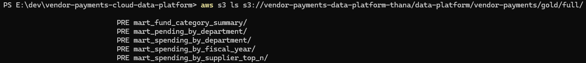
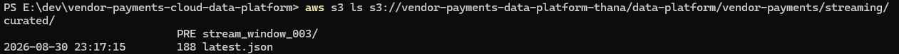
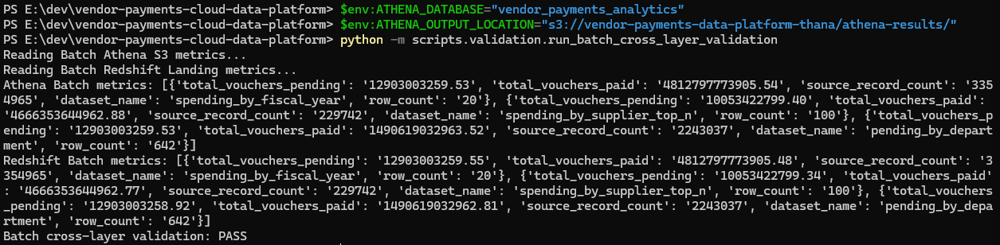
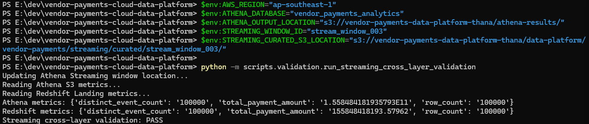
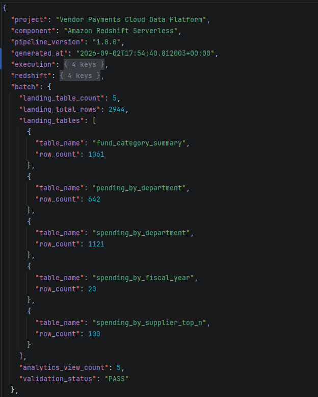
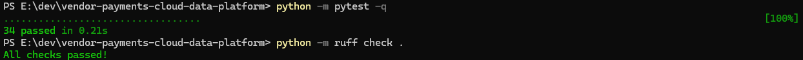
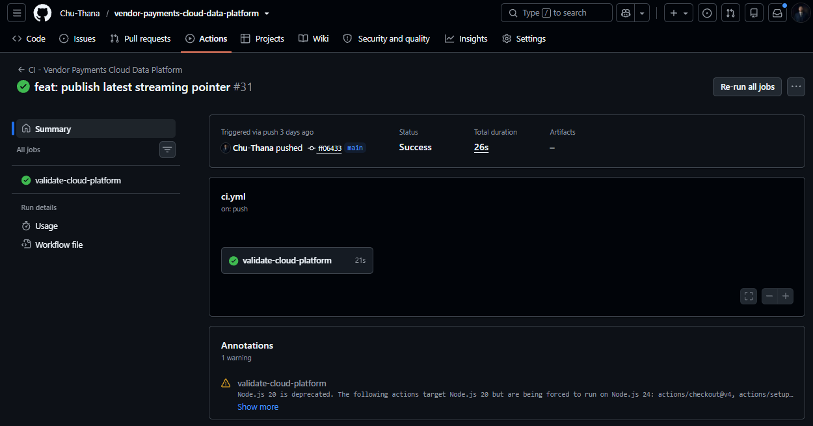
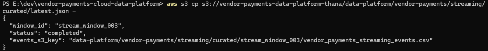

# ☁️ Vendor Payments Cloud Data Platform


AWS cloud and warehouse layer for the Vendor Payments Data Platform.

The current architecture keeps **Batch** and **Streaming** as independent cloud-processing paths. Both publish trusted outputs to Amazon S3, use Amazon Athena as an independent query layer over S3, load curated data into Amazon Redshift Serverless, and reconcile key metrics across the Data Lake and warehouse.

For Streaming, completed bounded windows are published under a window-specific S3 prefix, and `latest.json` identifies the latest fully completed window for downstream API serving.

---

## 📌 Project Summary

The Cloud Data Platform owns:

* Amazon S3 publishing and storage conventions
* Batch Gold cloud publishing
* Per-window Streaming curated publishing
* Amazon Athena database, external-table, and validation SQL
* Amazon Redshift schemas, landing tables, COPY operations, and analytics views
* Batch Athena ↔ Redshift cross-layer validation
* Streaming Athena ↔ Redshift cross-layer validation
* Redshift runtime metadata generation
* Streaming `latest.json` publication
* Automated tests, Ruff linting, and GitHub Actions CI

Responsibility boundary:

```text
Batch ETL / Kafka Streaming
→ produce validated upstream outputs

Cloud Data Platform
→ S3
→ Athena
→ Redshift
→ cross-layer validation
→ runtime metadata
→ latest.json

Airflow
→ orchestrates Cloud-owned scripts and SQL
```

The Cloud repository owns the implementation. Airflow owns execution order.

---

## 🧭 Architecture


```text
BATCH

Batch Gold
→ Amazon S3
├──→ Amazon Athena
└──→ Amazon Redshift
        ↓
Athena ↔ Redshift Validation
        ↓
Trusted Batch Analytics


STREAMING

Completed Bounded Window
→ Per-Window Curated CSV
→ Amazon S3
├──→ Amazon Athena
└──→ Amazon Redshift
        ↓
Athena ↔ Redshift Validation
        ↓
Publish latest.json
```

Batch and Streaming do not merge into one data flow. They share the same cloud platform and validation pattern while keeping separate datasets and lifecycles.

---

## 📊 Validated Results

| Metric | Result |
| --- | ---: |
| Batch Gold marts | 5 |
| Redshift Batch landing tables | 5 |
| Redshift Batch landing rows | 2,944 |
| Redshift Batch analytics views | 5 |
| Redshift Streaming landing tables | 1 |
| Streaming events loaded | 100,000 |
| Distinct Streaming event IDs | 100,000 |
| Duplicate Streaming event IDs | 0 |
| Missing Streaming event IDs | 0 |
| Redshift Streaming analytics views | 4 |
| Total Redshift analytics views | 9 |
| Batch cross-layer validation | PASS |
| Streaming cross-layer validation | PASS |
| Automated tests | 34 passed |
| Ruff linting | PASS |
| GitHub Actions CI | PASS |

---

## 🪣 Amazon S3 Data Lake

### Batch Gold

```text
data-platform/vendor-payments/gold/full/
├── mart_fund_category_summary/
├── mart_pending_by_department/
├── mart_spending_by_department/
├── mart_spending_by_fiscal_year/
└── mart_spending_by_supplier_top_n/
```



### Streaming Curated Output

```text
data-platform/vendor-payments/streaming/curated/
├── stream_window_<NNN>/
│   └── vendor_payments_streaming_events.csv
└── latest.json
```

The current S3 evidence shows the latest completed window:

```text
stream_window_003/
latest.json
```



---

## 🔎 Amazon Athena

Amazon Athena provides serverless SQL access directly over curated S3 data and acts as an independent validation layer over the Data Lake.

---

## 🔁 Batch Cross-Layer Validation

The Batch path compares Athena metrics over S3 with Redshift landing metrics.

Representative metrics:

```text
source_record_count
row_count
total_vouchers_paid
total_vouchers_pending
```

Counts are compared exactly. Monetary values use a controlled tolerance because Athena reads CSV-based values differently from Redshift decimal storage.

Latest result:

```text
Batch cross-layer validation: PASS
```



---

## 🌊 Streaming Cross-Layer Validation

The Streaming path updates Athena to the selected bounded-window S3 location and compares S3 metrics with Redshift.

Validated metrics:

```text
row_count
distinct_event_count
total_payment_amount
```

Latest verified window:

```text
stream_window_003
```

Latest result:

```text
Athena row_count              = 100000
Redshift row_count            = 100000
Athena distinct_event_count   = 100000
Redshift distinct_event_count = 100000

Streaming cross-layer validation: PASS
```



---

## 🏢 Amazon Redshift Serverless

The warehouse separates stored datasets from analytics logic:

```text
landing
analytics
```

### Batch Warehouse Validation

```text
landing_table_count  = 5
landing_total_rows   = 2944
analytics_view_count = 5
validation_status    = PASS
```

Validated Batch landing rows:

| Landing Table | Rows |
| --- | ---: |
| `fund_category_summary` | 1,061 |
| `pending_by_department` | 642 |
| `spending_by_department` | 1,121 |
| `spending_by_fiscal_year` | 20 |
| `spending_by_supplier_top_n` | 100 |
| **Total** | **2,944** |



### Streaming Warehouse Validation

```text
landing_table_count   = 1
total_rows            = 100000
rows_with_event_id    = 100000
distinct_event_ids    = 100000
duplicate_event_ids   = 0
missing_event_ids     = 0
analytics_view_count  = 4
total_events          = 100000
total_distinct_events = 100000
validation_status     = PASS
```


---

## 🧾 Runtime Metadata

Redshift execution metadata is generated by:

```text
scripts/warehouse/generate_redshift_summary.py
```

Generated artifact:

```text
output/reports/redshift_execution_summary.json
```

The report records project identity, execution metadata, Redshift configuration, Batch and Streaming warehouse metrics, validation state, and artifact metadata.

---

## 🧪 Automated Testing and Code Quality

```powershell
python -m pytest -q
python -m ruff check .
```

Current result:

```text
34 passed
All checks passed!
```



---

## ⚙️ Continuous Integration

GitHub Actions validates the repository on pushes and pull requests.

Latest result:

```text
validate-cloud-platform: Success
```



---

## 🔗 Latest Streaming Pointer

The Cloud layer publishes:

```text
data-platform/vendor-payments/streaming/curated/latest.json
```

Current pointer:

```json
{
  "window_id": "stream_window_003",
  "status": "completed",
  "events_s3_key": "data-platform/vendor-payments/streaming/curated/stream_window_003/vendor_payments_streaming_events.csv"
}
```



The API serving layer can resolve the latest completed Streaming dataset explicitly instead of relying on a hard-coded S3 key.

---

## 🗂️ Project Structure

```text
vendor-payments-cloud-data-platform/
│
├── .github/
│   └── workflows/
│       └── ci.yml
├── assets/
│   └── redshift/
│       ├── 00_cloud_data_platform_architecture.png
│       ├── 01_s3_batch_gold.png
│       ├── 02_s3_streaming_latest_pointer.png
│       ├── 03_athena_batch_cross_layer_validation.png
│       ├── 04_streaming_cross_layer_validation.png
│       ├── 05_redshift_batch_validation.png
│       ├── 06_redshift_streaming_validation.png
│       ├── 07_cloud_tests_and_lint.png
│       ├── 08_cloud_ci_success.png
│       └── 09_latest_pointer.png
├── scripts/
│   ├── athena/
│   │   └── run_athena_query.py
│   ├── batch/
│   ├── streaming/
│   │   └── publish_latest_streaming_pointer.py
│   ├── validation/
│   │   ├── compare_batch_metrics.py
│   │   ├── compare_streaming_metrics.py
│   │   ├── run_batch_cross_layer_validation.py
│   │   └── run_streaming_cross_layer_validation.py
│   └── warehouse/
│       └── generate_redshift_summary.py
├── sql/
│   ├── athena/
│   └── redshift/
├── output/
│   └── reports/
│       └── redshift_execution_summary.json
├── tests/
├── .env.example
├── .gitignore
├── pytest.ini
├── requirements.txt
└── README.md
```

---

## ▶️ Run Locally

Create and activate a virtual environment:

```powershell
python -m venv .venv
.venv\Scripts\Activate.ps1
```

Install dependencies:

```powershell
python -m pip install -r requirements.txt
```

Run validation:

```powershell
python -m pytest -q
python -m ruff check .
```

### Batch Cross-Layer Validation

```powershell
$env:AWS_REGION="ap-southeast-1"
$env:ATHENA_DATABASE="vendor_payments_analytics"
$env:ATHENA_OUTPUT_LOCATION="s3://vendor-payments-data-platform-thana/athena-results/"

python -m scripts.validation.run_batch_cross_layer_validation
```

### Streaming Cross-Layer Validation

```powershell
$env:STREAMING_WINDOW_ID="stream_window_003"
$env:STREAMING_CURATED_S3_LOCATION="s3://vendor-payments-data-platform-thana/data-platform/vendor-payments/streaming/curated/stream_window_003/"

python -m scripts.validation.run_streaming_cross_layer_validation
```

### Generate Redshift Runtime Metadata

```powershell
python scripts\warehouse\generate_redshift_summary.py
```

Cloud API calls require valid AWS credentials and access to the configured S3, Athena, and Redshift resources.

---

## ☁️ Airflow Integration

The Cloud repository remains independently testable, while Airflow invokes Cloud-owned scripts and SQL in bounded tasks.

```text
Batch Pipeline DAG
→ Upload Batch Gold to S3
→ Redshift Batch processing
→ Batch Athena ↔ Redshift validation

Streaming Pipeline DAG
→ Convert one completed window
→ Upload per-window curated output
→ Redshift Streaming processing
→ Streaming Athena ↔ Redshift validation
→ Publish latest.json

Main Platform DAG
→ Check Cloud readiness
→ Generate Redshift summary
→ Validate execution metadata
→ Generate orchestration summary
```

```text
Cloud repository = implementation
Airflow repository = orchestration
```

---

## 🔗 Role in the Vendor Payments Data Platform

```text
Batch ETL
→ Batch Pipeline DAG
→ S3 / Athena / Redshift

Kafka Streaming
→ _SUCCESS
→ Streaming Pipeline DAG
→ Per-Window S3 / Athena / Redshift
→ latest.json

latest.json
→ FastAPI
→ React Analytics
```

This repository is the cloud storage, serverless query, warehouse-processing, and cross-layer validation layer of the wider Vendor Payments platform.

---

## 🧠 Key Engineering Decisions

### Why keep Batch and Streaming paths separate?

Batch and Streaming have different processing lifecycles and storage units. The Cloud platform provides shared AWS services without forcing both workloads into one data flow.

### Why use Athena in addition to Redshift?

A successful Redshift load does not prove that S3 and Redshift contain consistent data. Athena provides an independent query path directly over S3 so key metrics can be reconciled.

### Why use per-window Streaming S3 paths?

A fixed Streaming object does not represent multiple independently completed processing windows. Window-specific paths preserve a clear processing boundary.

### Why publish `latest.json`?

Downstream consumers should not infer the latest completed dataset from timestamps or path ordering. `latest.json` provides an explicit pointer to the latest fully completed window.

### Why separate landing tables and analytics views?

Landing tables retain trusted loaded datasets, while analytics views provide reusable business and event-level logic without duplicating stored data.

### Why generate runtime metadata?

Machine-readable metadata makes execution state measurable and reusable by Airflow and portfolio evidence instead of relying only on terminal logs.

---

## 🛣️ Planned Development

Possible production-oriented improvements include:

* Infrastructure as Code
* Partition-aware S3 and Athena optimization
* Historical per-window retention policies
* Centralized Cloud observability
* Cost monitoring and reporting
* Automated failure alerting
* Stronger environment and secret management
* Additional Redshift performance tuning

---

## 🎯 Key Takeaway

The Cloud Data Platform extends independent Batch and Streaming pipelines into a shared AWS analytics platform without merging their lifecycles.

```text
Batch
→ S3
→ Athena + Redshift
→ Cross-Layer Validation

Streaming Window
→ Per-Window S3
→ Athena + Redshift
→ Cross-Layer Validation
→ latest.json
```

The result is a cloud layer with explicit storage boundaries, independent S3-to-warehouse reconciliation, trusted Redshift analytics, machine-readable execution metadata, and a clear serving contract for the latest completed Streaming window.
